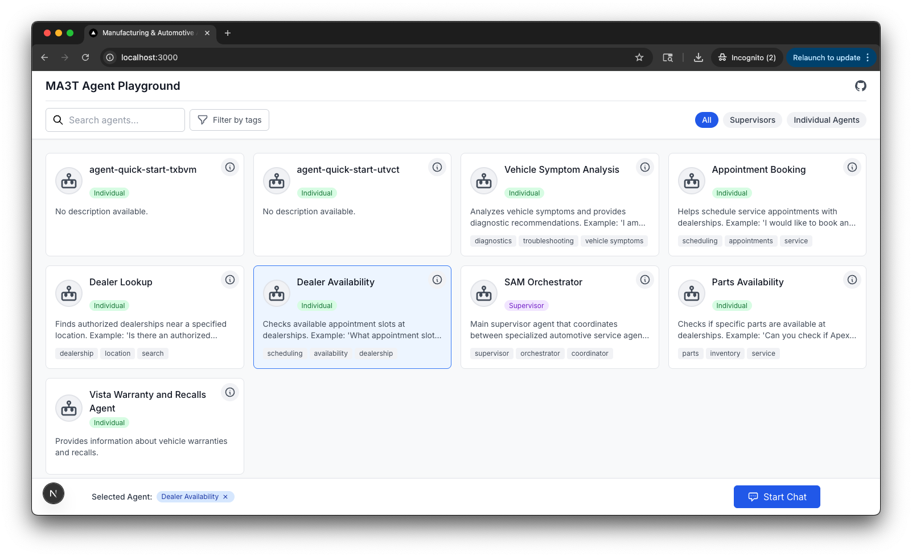

# Manufacturing & Automotive AI Toolkit (MA3T)

A collection of sample AI agents for Automotive and Manufacturing use cases.

## Deployment (CDK)

**Prerequisites:**
- AWS CLI configured with appropriate [permissions](#permissions)
- Node.js and npm installed 
- CDK CLI: `npm install -g aws-cdk`

**Automated Deploy:**
```bash
./deploy_cdk.sh
```
*Note: The CDK stack automatically triggers agent deployments via CodeBuild after successful deployment.*




## Architecture
The MA3T architecture consists of:

1. **Agent Catalog**: A collection of agents implemented using various frameworks
   - Standalone Agents: Individual agents for specific tasks
   - Multi-Agent Collaborations: Groups of agents that work together

2. **Agent Frameworks**:
   - AWS Bedrock Agents: Native, managed Bedrock agents
   - AgentCore Agents: Container-based agents using the Bedrock AgentCore framework
      - Support for Strands, LangGraph, CrewAI, and LlamaIndex

3. **UI Framework**: A Next.js+React-based user interface for interacting with agents
   - Single pane of glass for all agents
   - Automatic agent discovery and registration

4. **Deployment Framework**: CDK for deploying agents to AWS

## Contributing

We welcome additional agent example to the framework. Please see [CONTRIBUTING.md](CONTRIBUTING.md) for details.

To contribute an idea for an agent, please open an issue. If you'd like to contribute your own example, follow the instructions in [developing.md](/docs/developing.md).

## License

This project is licensed under MIT - see the [LICENSE](LICENSE) file for details.