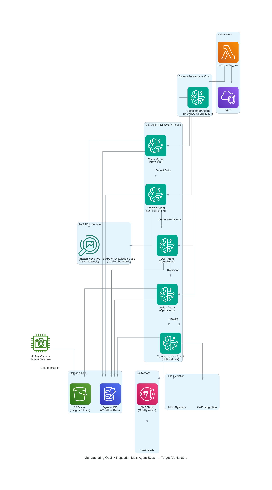

# Quality Inspection Multi-Agent System

AI-powered manufacturing quality inspection using Amazon Nova Pro and multi-agent architecture.

## Overview

Automated defect detection system that analyzes manufacturing part images against reference standards using 6 specialized AgentCore agents working in sequence.

## Architecture

### Agents

1. **Vision Agent** - Detects defects using Amazon Nova Pro computer vision
2. **Analysis Agent** - Analyzes defect data and quality metrics
3. **SOP Agent** - Applies standard operating procedures and compliance rules
4. **Action Agent** - Executes corrective actions and file routing
5. **Communication Agent** - Handles ERP integration and notifications
6. **Orchestrator Agent** - Coordinates the multi-agent workflow

### Workflow

```
S3 Upload → Lambda Trigger → Orchestrator → Vision → Analysis → SOP → Action → Communication
```

## Deployment

This agent is deployed automatically as part of the MA3T framework:

```bash
# From repository root
./deploy_cdk.sh --auth-user admin --auth-password yourpassword
```

The deployment:
1. Creates infrastructure (DynamoDB tables, S3 bucket, SNS topic, Lambda trigger)
2. Deploys all 6 agents to Bedrock AgentCore
3. Updates SSM parameters with runtime ARNs
4. Registers agents in the MA3T UI

## Usage

### Via S3 Trigger

Upload an image to the S3 bucket's `inputimages/` folder:

```bash
aws s3 cp part-image.jpg s3://YOUR-BUCKET/inputimages/
```

The Lambda trigger automatically invokes the orchestrator, which coordinates all agents.

### Via MA3T UI

Access the agent through the MA3T web interface after deployment.

## Infrastructure

### DynamoDB Tables
- `vision-inspection-data` - Vision analysis results
- `sop-decisions` - Compliance decisions
- `action-execution-log` - Action logs
- `erp-integration-log` - ERP updates
- `historical-trends` - Quality trends
- `sap-integration-log` - SAP integration

### S3 Bucket Structure
```
bucket/
├── inputimages/     # Upload images here
├── cleanimages/     # Reference images
├── accepted/        # Passed inspection
├── rework/          # Needs rework
└── scrap/           # Failed inspection
```

### SSM Parameters
- `/quality-inspection/primary-model/model-id` - Primary model ID
- `/quality-inspection/secondary-model/model-id` - Fallback model ID
- `/quality-inspection/reference-image-s3-uri` - Reference image location
- `/quality-inspection/agentcore-runtime/*` - Agent runtime ARNs (auto-populated)

## Configuration

Model configuration is stored in SSM Parameter Store and can be updated:

```bash
aws ssm put-parameter \
  --name /quality-inspection/primary-model/model-id \
  --value amazon.nova-pro-v1:0 \
  --overwrite
```

## Local Testing

Test individual agents locally:

```bash
cd src
python -m pytest ../tests/quality_inspection_full_test.py
```

## Monitoring

- **CloudWatch Logs**: `/aws/quality-inspection/*`
- **DynamoDB**: Query tables for inspection history
- **S3**: Check processed file locations
- **SNS**: Subscribe to quality alerts

## Architecture Diagram



See [ARCHITECTURE.md](docs/ARCHITECTURE.md) for detailed design documentation.
