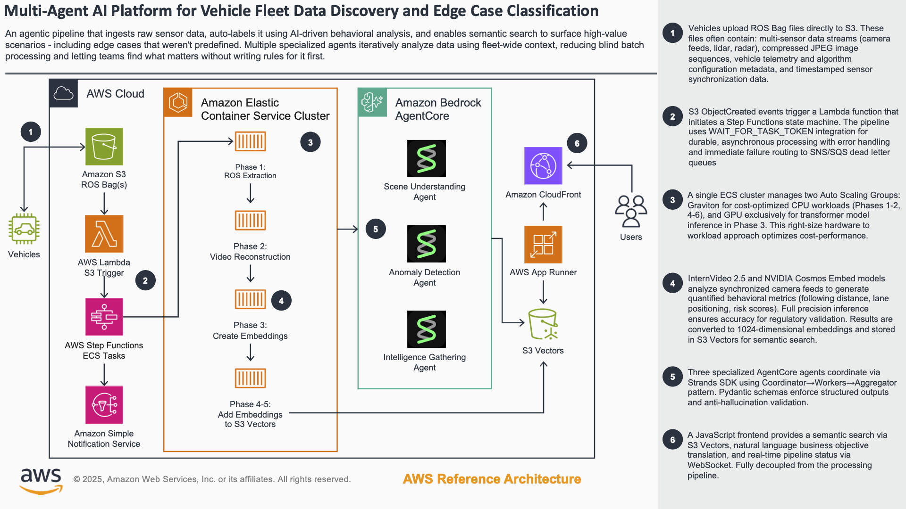

# Vehicle Data Discovery

An example multi-agent system for autonomous vehicle fleet data discovery and HIL (Hardware-in-the-Loop) testing optimization.

## Example Architecture



## Overview

This solution uses AI agents to analyze driving scenarios from fleet vehicles, identify edge cases, and optimize test data selection for HIL validation—reducing costs while maintaining safety coverage.

## Project Structure

```
04-Vehicle_Data_Discovery/
├── agents/          # AI agents (AgentCore/Strands)
├── api/             # FastAPI backend
├── frontend/        # Next.js React UI
├── pipeline/        # Data processing phases
│   ├── phase-1/     # ROS bag extraction
│   ├── phase-2/     # Video reconstruction
│   ├── phase-3/     # InternVideo2.5 analysis (GPU)
│   ├── phase-4-5/   # S3 Vectors embeddings
│   ├── phase-6/     # Agent orchestration
│   └── setup/       # Index creation scripts
└── infra/           # CDK infrastructure & Dockerfiles
```

## Key Components

- **Multi-Agent System**: Three specialized agents for scene understanding, anomaly detection, and similarity search
- **Twin-Engine Search**: Combines visual (Cosmos) and behavioral (Cohere) embeddings for semantic scene matching
- **6-Phase Pipeline**: Processes ROS bags through video extraction, AI analysis, and vector indexing
- **Fleet Discovery Studio**: Web UI for exploring scenes, coverage gaps, and ODD (Operational Design Domain) discovery

## Deployment

See the main repository [README](../../../README.md) for deployment instructions.
