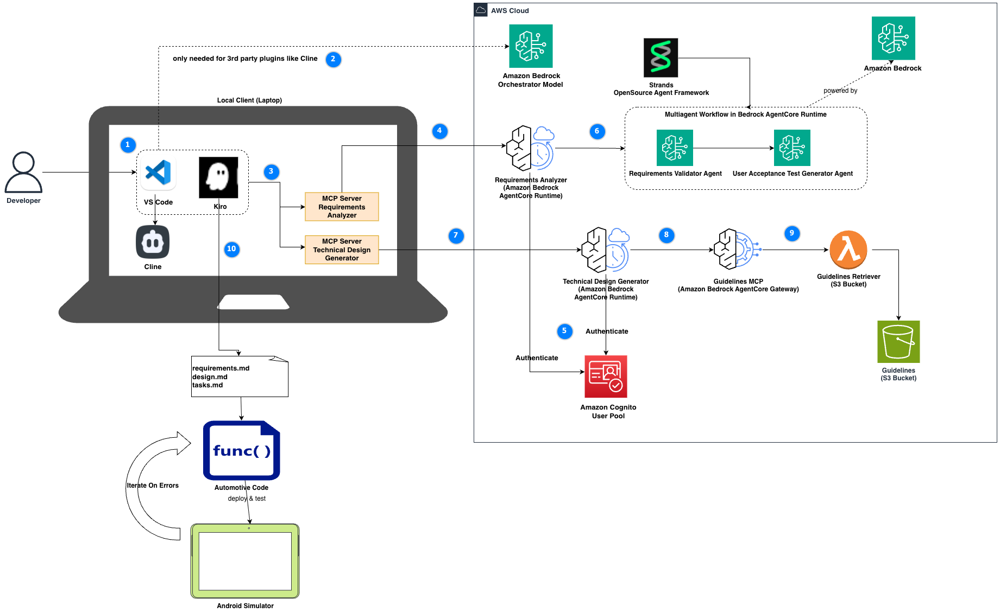

# Agentic Automotive V-Cycle Assistant

In this demo we are showcasing an a agentic V-Cycle assistant based on Kiro and Bedrock AgentCore, where an Android Weather-App is implemented based on the requirements.

Demo Flow:

1. Kiro makes use of Strands impl. hosted on Bedrock AgentCore (exposed as MCP endpoints to Kiro) to handle requirements analysis, user acceptance test generation and technical design generation
2. Kiro IDE used to to create detailed specifications using spec driven development. At the end Kiro comes up with decomposed tasks based on the documents from step 1.
3. Kiro-CLI is used to iterate over coding, testing and deployment via Android emulators.

An example of a navigation flow with Kiro following the numbering in the diagram might look like this:

1. Developer prompts __"analyze requirements of weather-app"__.
2. Using the underlying orchestrator model, Kiro understands that the task can be handled using the requirements analyzer MCP. Kiro searches the workspace for business requirements specification of the weather-app.
3. Kiro calls the "requirements analyzer" tool to validate the requirements and generate user acceptance tests if applicable.
4. MCP Server forwards the request to AgentCore Runtime.
5. AgentCore Runtime uses Amazon Cognito to authenticate the user.
6. AgentCore Runtime utilizes the multi-agent workflow implemented in Strands to generates a requirements analysis report and user acceptance tests. The analysis report and user acceptance test document are saved in the workspace. Note that the model for each of these steps can be chosen according to the specific task and does not have to be the same.
7. After the developer reviews/adjusts the documents, the user may want to generate technical designs. Upon prompting __"generate technical design for weather-app"__, this time Kiro calls the technical design generator which delegates to respective AgentCore Runtime endpoint.
8. After authentication via Cognito, technical design generator agent calls Guidelines MCP tool hosted in AgentCore Gateway.
9. Agent retrieves the technical guidelines located in the S3 bucket and generates the technical design and sends it back to Kiro. Kiro saves the document in the local workspace.
10. Now developer can make use of Kiro IDE to initiate a spec driven development based on requirements and tech. design. An example prompt can be found [here](./sample-data/weather-app/demo-prompts.md#create-spec-for-first-weather-app-iteration-kiro-ide). This results in respective specs documents.
11. After review by the developer, Kiro CLI can be used to go forward with code generation and to validate the implementation using the integrated Android Simulator. An example prompt can be found [here](./sample-data/weather-app/demo-prompts.md#implement-all-tasks-of-spec-kiro-cli). In case of problems the agent is able to iterate and fix the code iteratively until the application is fully developed.

## Components

### 1. Requirements Analyzer Agent  
Multi-agent system for business and technical requirements analysis with user acceptance test generation.

**Key Features:**
- Analyzes business requirements documents for consistency and completeness
- Checks for conflicting requirements and missing sections
- Generates comprehensive user acceptance test specifications
- Supports IEEE 830 standards and automotive requirements workflows

**Location:** `requirements-agent/`  
**MCP Server:** `mcp-servers/automotive-requirements-mcp/`  
**Documentation:** See [Requirements Analyzer README](requirements-agent/README.md) for detailed elaboration and interactive deployments.

### 2. Software Design Agent
Multi-agent system that transforms validated requirements into comprehensive technical design documents for automotive software development.

**Key Features:**
- Generates technical design documents from validated requirements
- Validates design completeness with severity-based analysis (LOW, MEDIUM, HIGH)
- Conditionally validates design quality when completeness criteria are met
- Ensures alignment with automotive safety standards (ISO 26262, UNECE WP.29)
- Includes architecture diagrams, component specifications, interface definitions, and data models

**Location:** `backend/design-agent/`  
**MCP Server:** `mcp-servers/automotive-design-mcp/`  
**Documentation:** See [Software Design Agent README](design-agent/README.md) for detailed elaboration and interactive deployments.

### 3. C Code Analyzer Agent
Multi-agent system for automotive C code analysis with custom automotive coding standards compliance checking and unit test generation.

**Key Features:**
- Analyzes C code for custom automotive coding standards violations (AUTO-SAFE-001, AUTO-MEM-001, AUTO-FUNC-001, AUTO-STYLE-001)
- Categorizes violations by severity (LOW, MEDIUM, HIGH)
- Conditionally generates comprehensive unit tests for compliant code
- Includes edge cases, boundary conditions, and automotive testing standards

**Location:** `backend/c-code-analyzer-agent/`  
**MCP Server:** `mcp-servers/automotive-coding-mcp/`  
**Documentation:** See [C Code Analyzer README](c-code-analyzer-agent/README.md) for detailed elaboration and interactive deployments.

## IDE Integration Support
The project support Kiro and Cline based integrations. Kiro with Android setup is already set as the default and the files are available directly under ./kiro. Additional configuration files are available under 
- **Location**: `ide-support/`
- See respective README files for detailed instructions. 

## Deployment

### Automated (via MA3T CDK)

The project integrates with MA3T's deployment pipeline:

1. **CDK stack** is discovered by `nested_stack_registry.py` via the top-level `manifest.json`
2. **Per-agent manifests** are discovered by `build_launch_agentcore.py` via `os.walk`
3. Run `cd ma3t && ./deploy_cdk.sh` to deploy infrastructure and agents
4. After the deployment, retrieve the .bedrock_agentcore.yaml files from the S3 bucket and save them under `catalog/automotive-vcycle/design-agent/.bedrock_agentcore.yaml`, `catalog/automotive-vcycle/requirements-agent/.bedrock_agentcore.yaml` or `catalog/automotive-vcycle/c-code-analyzer-agent/.bedrock_agentcore.yaml` respectively.
5. Adjust the Settings/Steering Files for Local IDE
- For Kiro, extend the default setup in the workspace (`./kiro` folder) by adding the c-code analyzer configuration. Add additional steering file under '/ide-support/kiro'
- For Cline, use `./ide-support/cline`.
- Update the Cognito Client-Id in the mcp.json with the value from `allowedClients` from respective .bedrock_agentcore.yaml
- Adjust your Python environment path in mcp.json if necessary.
- Adjust your commands and args paths in mcp.json if necessary.

### Interactive (via Notebooks)

For development and experimentation, follow the instructions in the respective README files of each agent.
