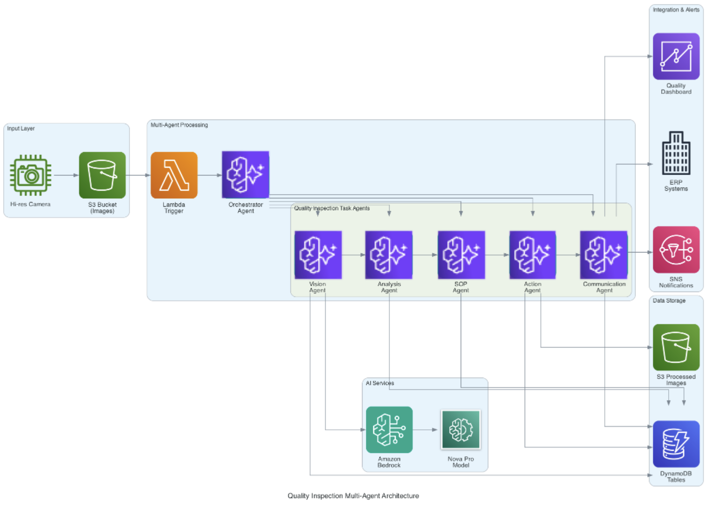

# Manufacturing Quality Inspection Multi-Agent System

AI-powered quality inspection system using Amazon Nova Pro and multi-agent architecture for manufacturing defect detection and workflow automation.

## 🏭 System Overview

This system implements a complete manufacturing quality inspection pipeline using:
- **Amazon Nova Pro** for visual defect detection. The solution uses Amazon Nova Pro which is currently only available in US-EAST-1
and in GovCloud for US.

If you are outside of the US, pick the appropriate region. You can find supported regions here: https://docs.aws.amazon.com/bedrock/latest/userguide/models-supported.html

- **Multi-Agent Architecture** with Strands framework
- **Real-time Processing** with S3 and DynamoDB integration
- **SNS Notifications** for quality alerts
- **Complete Audit Trail** across all manufacturing decisions



## 🤖 Agent Architecture

The system follows a sequential workflow with 6 specialized agents. All agents are using the Strands Agents framework (https://strandsagents.com/latest/):

### 1. Orchestrator Agent
- **Purpose**: Workflow coordination and multi-agent management
- **Technology**: Strands Agents framework with AgentCore runtime, Amazon Nova Pro LLM on Amazon Bedrock
- **Input**: S3 event triggers and workflow state
- **Output**: Agent coordination, workflow orchestration, and state management

### 2. Vision Agent
- **Purpose**: Defect detection using computer vision
- **Technology**: Strands Agents framework with AgentCore runtime, Amazon Nova Pro multimodal AI
- **Input**: Manufacturing part images vs reference
- **Output**: Defect classification, coordinates, and measurements

### 3. Analysis Agent
- **Purpose**: Intelligent reasoning and quality assessment
- **Technology**: Strands Agents framework with AgentCore runtime, Amazon Nova Pro LLM on Amazon Bedrock
- **Input**: Vision agent results and quality standards
- **Output**: Detailed defect analysis and quality recommendations

### 4. SOP Agent  
- **Purpose**: Apply Standard Operating Procedures
- **Technology**: Strands Agents framework with AgentCore runtime, Amazon Nova Pro LLM on Amazon Bedrock
- **Input**: Analysis agent recommendations
- **Output**: Final disposition decisions (accept/rework/scrap)

### 5. Action Agent
- **Purpose**: Execute physical manufacturing actions
- **Technology**: Strands Agents framework with AgentCore runtime, Amazon Nova Pro LLM on Amazon Bedrock
- **Input**: SOP disposition decisions
- **Output**: S3 operations, production system updates

### 6. Communication Agent
- **Purpose**: ERP integration and stakeholder notifications
- **Technology**: Strands Agents framework with AgentCore runtime, Amazon Nova Pro LLM on Amazon Bedrock
- **Output**: System updates, quality alerts, audit logs

## 🚀 Quick Start

### Prerequisites
- AWS Account with Bedrock access
- Python 3.10+
- AWS CLI configured

### Local Development and Deployment
```bash
# Clone repository
git clone <repository-url>
cd quality-inspection

# Install dependencies
pip install -r requirements.txt

# Deploy AWS infrastructure and AgentCore runtimes
./deploy/deploy_full_stack_quality_inspection.sh

# Run Streamlit application locally for testing and demos
# Note: The Streamlit app uses your currently active AWS profile
# Ensure the solution is deployed in the same AWS account
streamlit run src/demo_app/quality-inspection-streamlit-demo.py

# Destroy all resources (CDK stack and AgentCore runtimes)
./deploy/destroy_full_stack_quality_inspection.sh

## 📁 Project Structure

```
quality-inspection/
├── cdk/                         # Infrastructure as Code (CDK)
│   ├── app.py                   # CDK application entry point
│   ├── quality_inspection_stack.py # Main CDK stack
│   ├── quality_inspection_streamlit_demo_stack.py # Streamlit deployment stack
│   ├── cdk.json                 # CDK configuration
│   ├── cdk.context.json         # CDK context
│   └── requirements.txt         # CDK dependencies
├── deploy/                      # Deployment scripts
│   ├── deploy_full_stack_quality_inspection.sh # Full deployment script
│   └── quality_inspection_agentcore_deploy.sh # AgentCore deployment script
├── src/                         # Source code
│   ├── agents/                  # Multi-agent implementations
│   ├── demo_app/                # Streamlit demo applications
│   ├── lambda_functions/        # AWS Lambda functions
│   ├── tools/                   # Utility tools
│   └── agentcore_deployment_results.md # Deployment results
├── tests/                       # Test files and test images
│   ├── scripts/                 # Agent test scripts
│   └── test_images/             # Test image datasets
├── docs/                        # Documentation
├── manifest.json                # Agent manifest
├── requirements.txt             # Python dependencies
└── README.md                    # This file
```

## 🔧 Configuration

### AWS Profile Requirements
**Important**: The Streamlit demo application uses your currently active AWS profile/credentials. You must:
- Have the solution deployed in the same AWS account as your active profile
- Ensure your AWS credentials are valid (run `aws sts get-caller-identity` to verify)
- For SSO users: Run `aws sso login` if your token has expired

### Agent Configuration
Agent configuration is handled in `src/agents/model_config.py`:
```python
# Model configuration for all agents
MODEL_ID = "amazon.nova-pro-v1:0"
TEMPERATURE = 0.1
MAX_TOKENS = 4000
```

AWS resources are configured via CDK deployment with dynamic naming based on account ID.

## 📊 Data Flow

1. **Image Upload** → S3 `inputimages/` folder
2. **Vision Analysis** → Nova Pro defect detection with coordinates
3. **Quality Analysis** → AI-powered defect assessment and reasoning
4. **SOP Compliance** → Rule-based disposition decisions
5. **Physical Actions** → File routing and production control
6. **Communications** → ERP updates, alerts, and audit logging

## 🗄️ Database Schema

### DynamoDB Tables
- `vision-inspection-data` - Vision analysis results
- `sop-decisions` - SOP compliance decisions
- `action-execution-log` - Physical action logs
- `erp-integration-log` - ERP system updates
- `historical-trends` - Quality trend data
- `sap-integration-log` - SAP integration logs

## 🔔 Notifications

- **Quality Alerts**: SNS notifications for defects
- **Production Updates**: ERP system integration
- **Trend Reports**: Automated quality analytics

## 🧪 Testing

```bash
# Run all agent tests
python tests/scripts/run_all_agent_tests.py

# Test individual agents
python tests/scripts/quality_inspection_orchestrator_test.py
python tests/scripts/quality_inspection_vision_agent_test.py
python tests/scripts/quality_inspection_analysis_agent_test.py
python tests/scripts/quality_inspection_sop_agent_test.py
python tests/scripts/quality_inspection_action_agent_test.py
python tests/scripts/quality_inspection_communication_agent_test.py

# Full end-to-end test
python tests/scripts/quality_inspection_full_test.py
```

### Test Images
Test images are available for demo app or direct S3 upload:
- **Anomaly images**: `tests/test_images/anomalies/` (image1.jpg, image2.jpg, image3.jpg, image4.jpg)
- **Clean images**: `tests/test_images/clean/` (Cleanimage3.jpg through Cleanimage14.jpg)
- **Reference image**: `tests/test_images/reference_image/Cleanimage.jpg`

## 📈 Monitoring

- **Agent Logs**: Real-time execution tracking
- **Processing History**: Complete workflow audit
- **Quality Metrics**: Defect rates and trends
- **System Health**: AWS CloudWatch integration
- **AgentCore Observability**: Built-in monitoring and tracing

## 🤝 Contributing

1. Fork the repository
2. Create feature branch (`git checkout -b feature/amazing-feature`)
3. Commit changes (`git commit -m 'Add amazing feature'`)
4. Push to branch (`git push origin feature/amazing-feature`)
5. Open Pull Request

## 📄 License

This project is licensed under the MIT License - see the LICENSE file for details.

## 🆘 Support

For support and questions:
- Create an issue in this repository
- Check the documentation in `/docs`
- Review the troubleshooting guide

## 🧹 Cleanup

### Complete Resource Cleanup
To destroy all resources including CDK stack and AgentCore runtimes:
```bash
./deploy/destroy_full_stack_quality_inspection.sh
```

This script will:
- Destroy all 6 AgentCore agent runtimes
- Clean up ECR repositories and CodeBuild projects
- Remove IAM roles and policies
- Destroy the CDK infrastructure stack
- Clean up S3 buckets and DynamoDB tables

### AgentCore Only Cleanup
To destroy only AgentCore agents (keeping CDK infrastructure):
```bash
./deploy/destroy_agentcore_only.sh
```

## 🔮 Roadmap

- [ ] Real-time streaming processing
- [ ] Advanced ML model integration
- [ ] Mobile app for quality inspectors
- [ ] Integration with more ERP systems
- [ ] Predictive maintenance algorithms
- [ ] Amazon Quick Sight dashboard integration

## 📝 Additional Notes

This solution was developed for the AWS commercial cloud partition and not all functionality is available in AWS GovCloud at the current time.