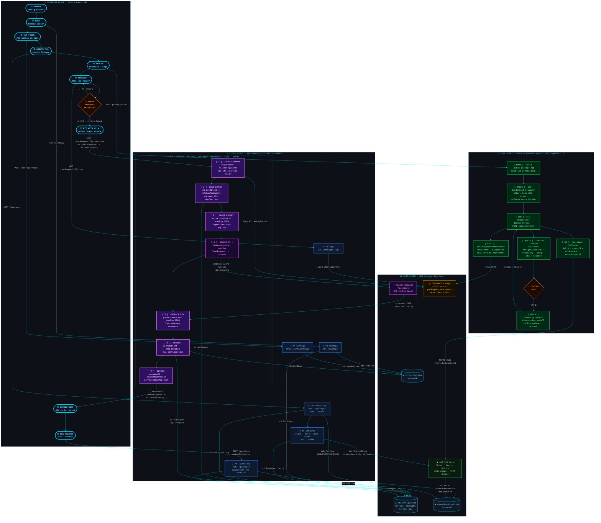

# SFC Control Plane – Architecture Design

## Overview

This document describes the architecture for the **SFC Control Plane** — a serverless web application and backend that extends the existing `SfcAgentStack` CDK stack. The control plane enables operators to browse, edit and activate SFC configurations, assemble self-contained "Launch Packages" for edge deployment, stream and visualise SFC runtime logs (in OpenTelemetry format), and trigger AI-assisted remediation or AWS IoT Greengrass v2 component creation.

---

## End-to-End Flow



> **Legend** `◈` S3/DDB stores  `◉` IoT Core  `◎` CloudWatch  `✦` AI/Bedrock  `λ` Lambda  `⬡` operator/edge planes
> **Colours** — 🟣 magenta/violet: AI remediation · 🟢 green: edge device · 🔵 blue: AWS Lambda · ⚫ dark teal: data stores · 🟡 amber: CloudWatch · 🟠 orange: decision gates · 🩵 cyan: operator actions

---

### Existing Stack (baseline)

The current `SfcAgentStack` already provisions:

| Resource | Purpose |
|---|---|
| `SfcConfigBucket` (S3, versioned) | Stores SFC config JSON files at `configs/{configId}/{version}/config.json` |
| `SfcConfigTable` (DDB, PK: `configId`, SK: `version`) | Config metadata: name, description, s3Key, status, createdAt |

All new resources are added to the same CDK stack via dedicated construct classes.

---

## 1. High-Level Architecture

```
┌─────────────────────────────────┐
│  Browser  (Vite + React SPA)    │
│  • Config File Browser          │
│  • Monaco JSON Editor           │
│  • Launch Package Manager       │
│  • OTEL Log Viewer (CloudWatch) │
└───────────────────────┬─────────┘
                        │ HTTPS
                        ▼
         ┌──────────────────────────────────────┐
         │  Amazon CloudFront                   │
         │  /api/*  → API Gateway               │
         │  /*      → SfcConfigBucket/ui/ (OAC) │
         └──────┬───────────────────────────────┘
                │
                ▼
   ┌──────────────────────────────────────────────────────────────────────────┐
   │      Amazon API Gateway HTTP API  (OpenAPI 3.0 spec)                     │
   │        CORS: localhost:5173  +  CloudFront origin                        │
   └──┬──────────┬──────────┬────────┬──────────┬───────┬──────────┬──────────┘
      │          │          │        │          │       │          │
  fn-configs  fn-launch  fn-iot   fn-logs   fn-gg  fn-agent   fn-iot
              -pkg       -prov              -comp   -remediate -control
```

---

## 2. Frontend — Vite + React + TypeScript

### Technology Stack

| Concern | Choice |
|---|---|
| Build tool | Vite |
| UI framework | React 18 + TypeScript |
| JSON editing | Monaco Editor (with SFC JSON Schema) |
| Data fetching | TanStack Query v5 |
| Styling | Tailwind CSS (utility-first, no icon-heavy decorations) |
| HTTP client | `axios` (generated from OpenAPI spec via `openapi-typescript-codegen`) |

### Pages / Routes

| Route | View | Key Actions |
|---|---|---|
| `/` | **Config File Browser** | Table of all SFC configs (name, version, last-modified, status). Click to open. |
| `/configs/:configId` | **Config Editor** | Monaco JSON editor. Toolbar: Save new version, Revert, Set as Focus, Create Launch Package. |
| `/packages` | **Launch Package List** | Table: live status LED, provisioning status badge, download button, logs link, GG export button, Fix-with-AI button, Controls button. |
| `/packages/:packageId` | **Package Detail & Runtime Controls** | Left panel: package info, IoT resources, action CTAs. Right panel: Runtime Controls — Telemetry toggle, Diagnostics toggle, Push Config Update, Restart SFC. All controls disabled (greyed) when `status != READY`. |
| `/packages/:packageId/logs` | **Log Viewer** | Paginated, colour-coded OTEL log stream. ERROR lines highlighted. "Fix with AI" CTA when errors present. |

### Runtime Controls Panel (`PackageControlPanel.tsx`)

The right panel of the Package Detail view provides operators with direct control over the running `aws-sfc-runtime-agent` on the edge device. Control state is pre-loaded from `GET /packages/{packageId}/control` (DynamoDB-persisted — no live MQTT dependency).

```
┌──────────────────────────────────────────────────────┐
│  Runtime Controls                                    │
│                                                      │
│  Telemetry (OTEL)          ● ON  ○ OFF    [Apply]    │
│  Diagnostics (TRACE log)   ● ON  ○ OFF    [Apply]    │
│                                                      │
│  ────────────────────────────────────────────────────│
│  Push Config Update                                  │
│  Config:   [dropdown — configs in focus or all]      │
│  Version:  [dropdown — versions of selected config]  │
│            [Push Update]                             │
│                                                      │
│  ────────────────────────────────────────────────────│
│  Restart SFC Runtime         [Restart ↺]             │
│  Last restart: 2026-02-24 14:32 UTC                  │
└──────────────────────────────────────────────────────┘
```

- **Telemetry / Diagnostics**: toggle switches pre-populated from persisted state; "Apply" fires `PUT .../control/telemetry` or `.../control/diagnostics`; button shows spinner then ✓ tick
- **Push Config Update**: version dropdown populated from `GET /configs/{configId}/versions`; submit calls `POST .../control/config-update`; shows confirmation toast with pushed version
- **Restart ↺**: confirmation dialog required before calling `POST .../control/restart`; `lastRestartAt` displayed below button
- All controls disabled with tooltip *"Package must be in READY state"* when `status != READY`

### Device Status LED — `HeartbeatStatusLed.tsx`

A reusable LED indicator component used in both the Package List table column and at the top of the Package Detail control panel. State is derived from `GET /packages/{packageId}/heartbeat`, polled every **10 seconds** via TanStack Query `refetchInterval`.

**LED states:**

| LED | Condition |
|---|---|
| `● ACTIVE` (green) | `lastHeartbeatAt` within 15 s AND `sfcRunning=true` |
| `● ERROR` (red) | `lastHeartbeatAt` within 15 s AND `sfcRunning=false` (agent alive, SFC crashed) |
| `○ INACTIVE` (grey) | `lastHeartbeatAt` older than 15 s, or no heartbeat ever received |

**Package List** — LED column layout:

```
┌──────────────────────────────────────────────────────────────────────┐
│  Package ID   Config        Status    Live         Last Seen         │
│  abc-123      factory-opc   READY     ● ACTIVE     3s ago            │
│  def-456      press-line    READY     ● ERROR      2s ago            │
│  ghi-789      line-opcua    READY     ○ INACTIVE   4m ago            │
│  jkl-012                   PROVISIONING  —         —                 │
└──────────────────────────────────────────────────────────────────────┘
```

**Package Detail** — top of `PackageControlPanel.tsx`:

```
┌──────────────────────────────────────────────────────┐
│  Device Status                                       │
│  ● ACTIVE  —  SFC running  —  Last seen: 3s ago      │
│                                                      │
│  Recent SFC output:                                  │
│  [14:32:10] INFO  Reading source OPC-UA node ...     │
│  [14:32:05] INFO  ProtocolAdapter started            │
│  [14:32:01] WARN  Retry attempt 1 for node ...       │
│                              [Open full log viewer]  │
└──────────────────────────────────────────────────────┘
```

The "Recent SFC output" block auto-refreshes with each heartbeat poll (10 s). Log lines are colour-coded: INFO = default, WARN = amber, ERROR = red. "Open full log viewer" navigates to `/packages/:packageId/logs`.

### Design Tenets (UI)

- No stock icon libraries — use minimal SVG inline icons only where strictly necessary
- Professional monochromatic colour scheme; severity colour only in log viewer (green/yellow/red)
- "Config in Focus" concept surfaced prominently: persistent banner showing the currently focused config name + version
- Primary CTA flow: **Browse config → Edit → Set as Focus → Create Launch Package → Monitor Logs**

---

## 3. Backend API — Amazon API Gateway HTTP API

### Design Principles

- **HTTP API** (not REST API) — lower latency, lower cost, native Lambda proxy
- **OpenAPI 3.0 spec** (`cdk/openapi/control-plane-api.yaml`) is the single source of truth; imported into API GW via CDK `HttpApi` with `ApiDefinition.from_asset(...)`
- All integrations: **Lambda proxy (synchronous)**
- Runtime: **Python 3.12** for all Lambda functions
- Shared utilities via a common **Lambda Layer** (`sfc-cp-layer`)
- CORS configured for `http://localhost:5173` (dev) and the CloudFront distribution URL (prod)

### 3.1 Config Management — `fn-configs`

| Method | Path | Description |
|---|---|---|
| `GET` | `/configs` | List all configs — DDB scan with latest-version projection |
| `GET` | `/configs/focus` | Get the current "config in focus" from `ControlPlaneStateTable` |
| `POST` | `/configs/{configId}/focus` | Set a config version as "in focus" |
| `GET` | `/configs/{configId}` | Get latest version metadata + S3 content |
| `GET` | `/configs/{configId}/versions` | List all versions (DDB Query on `configId`) |
| `GET` | `/configs/{configId}/versions/{version}` | Get specific version content from S3 |
| `PUT` | `/configs/{configId}` | Save edited config — creates new DDB item + S3 object |

### 3.2 Launch Package Management — `fn-launch-pkg`

| Method | Path | Description |
|---|---|---|
| `POST` | `/packages` | Full package creation orchestration: (1) creates `LaunchPackageTable` record with `status=PROVISIONING`, (2) snapshots SFC config from S3, (3) provisions IoT Thing/cert/role via shared `sfc_cp_utils/iot.py` layer, (4) rewrites SFC config with `AwsIotCredentialProviderClients` block, (5) assembles zip in-memory, (6) writes zip to `SfcConfigBucket` under `packages/{packageId}/launch-package.zip`, (7) sets `status=READY`. Returns `{ packageId, status, downloadUrl }`. Timeout: 60 s. |
| `GET` | `/packages` | List all Launch Packages |
| `GET` | `/packages/{packageId}` | Get package details (status, IoT resources, log group) |
| `GET` | `/packages/{packageId}/download` | Generate presigned S3 URL for zip download |
| `DELETE` | `/packages/{packageId}` | Delete package record (and optionally IoT resources) |

### 3.3 IoT Provisioning — `fn-iot-prov`

| Method | Path | Description |
|---|---|---|
| `POST` | `/packages/{packageId}/iot` | **Re-provisioning only**: mints a fresh IoT cert for a new `packageId` that inherits `configId` and `configVersion` from the source package. The old package record and zip are preserved unchanged (clean audit trail). UI presents this as *"Create replacement package with new credentials"*. |
| `GET` | `/packages/{packageId}/iot` | Get provisioning status and IoT resource ARNs |
| `DELETE` | `/packages/{packageId}/iot` | Revoke certificate and delete IoT Thing (cert compromise scenario) |

> **Note:** The IoT provisioning **logic** is shared via `sfc_cp_utils/iot.py` (Lambda Layer) and is called directly by `fn-launch-pkg` during initial package creation — no internal HTTP hop. The `/packages/{packageId}/iot` endpoints serve independent lifecycle operations only (status inspection, cert revocation, re-provisioning).

**IAM role derivation logic** (inside `fn-iot-prov`):

The function inspects the SFC config's `targets` section to derive the minimum required IAM permissions:

| SFC Target Type | IAM Actions Added |
|---|---|
| `AwsIotTarget` | `iot:Publish` on the configured topic ARN |
| `AwsSiteWiseTarget` | `iotsitewise:BatchPutAssetPropertyValue` |
| `KinesisTarget` | `kinesis:PutRecord`, `kinesis:PutRecords` on stream ARN |
| `S3Target` | `s3:PutObject` on bucket ARN |
| CloudWatch Logs (OTEL) | `logs:CreateLogGroup`, `logs:CreateLogDelivery`, `logs:PutLogEvents`, `logs:DescribeLogStreams` on `/sfc/launch-packages/{packageId}` |

A **permissions boundary policy** is attached to every dynamically created IAM role to prevent privilege escalation beyond the above scope.

**IoT policy attached to provisioned Thing** (managed by `fn-iot-prov`):

In addition to the SFC target-derived IAM actions above, the IoT policy document attached to each provisioned Thing grants the edge device the permissions required to operate the MQTT control channel:

| IoT Action | Resource |
|---|---|
| `iot:Connect` | `arn:aws:iot:{region}:{account}:client/sfc-{packageId}` |
| `iot:Subscribe` | `arn:aws:iot:{region}:{account}:topicfilter/sfc/{packageId}/control/*` |
| `iot:Receive` | `arn:aws:iot:{region}:{account}:topic/sfc/{packageId}/control/*` |
| `iot:Publish` | `arn:aws:iot:{region}:{account}:topic/sfc/{packageId}/heartbeat` |

### 3.4 Log Retrieval — `fn-logs`

| Method | Path | Query Params | Description |
|---|---|---|---|
| `GET` | `/packages/{packageId}/logs` | `startTime`, `endTime`, `nextToken`, `limit` | Fetch OTEL-structured log events from CW log group |
| `GET` | `/packages/{packageId}/logs/errors` | `startTime`, `endTime` | Filter for `SeverityText=ERROR` or `SeverityNumber>=17` — used as AI remediation input |

### 3.5 Greengrass Component — `fn-gg-comp`

| Method | Path | Description |
|---|---|---|
| `POST` | `/packages/{packageId}/greengrass` | Create GG v2 component version using the zip as artifact |
| `GET` | `/packages/{packageId}/greengrass` | Get component ARN and deployment status |

### 3.6 Runtime Control — `fn-iot-control`

A single, purpose-built Lambda that publishes MQTT messages to the four control topics via the **AWS IoT Data Plane** (`boto3` `iot-data` client, `publish`). It also persists the last-known toggle state and event timestamps to `LaunchPackageTable` so the UI always reflects current device intent without an MQTT round-trip.

| Method | Path | Body | Description |
|---|---|---|---|
| `GET` | `/packages/{packageId}/control` | — | Returns persisted control state: `telemetryEnabled`, `diagnosticsEnabled`, `lastConfigUpdateAt`, `lastConfigUpdateVersion`, `lastRestartAt` |
| `PUT` | `/packages/{packageId}/control/telemetry` | `{"enabled": true\|false}` | Publishes `{"enabled": true\|false}` to `sfc/{packageId}/control/telemetry`; persists `telemetryEnabled` to `LaunchPackageTable` |
| `PUT` | `/packages/{packageId}/control/diagnostics` | `{"enabled": true\|false}` | Publishes `{"enabled": true\|false}` to `sfc/{packageId}/control/diagnostics`; persists `diagnosticsEnabled` to `LaunchPackageTable` |
| `POST` | `/packages/{packageId}/control/config-update` | `{"configId": "...", "configVersion": "..."}` | Generates an S3 presigned URL (5 min TTL) for the requested config version; publishes `{"presignedUrl": "..."}` to `sfc/{packageId}/control/config-update`; persists `lastConfigUpdateAt` + `lastConfigUpdateVersion` to `LaunchPackageTable` |
| `POST` | `/packages/{packageId}/control/restart` | — | Publishes `{"restart": true}` to `sfc/{packageId}/control/restart`; persists `lastRestartAt` to `LaunchPackageTable` |
| `GET` | `/packages/{packageId}/heartbeat` | — | Returns `lastHeartbeatAt`, `sfcRunning`, `recentLogs` from `LaunchPackageTable`. If `now − lastHeartbeatAt > 15 s` the response includes `"liveStatus": "INACTIVE"` regardless of `sfcRunning`; otherwise `"ACTIVE"` or `"ERROR"` (when `sfcRunning=false`). |

**Implementation notes:**
- All publish calls use `iotDataClient.publish(topic=..., qos=1, payload=json.dumps(...))`
- Function validates `LaunchPackageTable.status == READY` before publishing; returns `409 Conflict` otherwise
- `GET /control` returns synthetic `"unknown"` for packages that predate this feature (missing state attributes)
- Topic paths are constructed as `sfc/{packageId}/control/{action}` using the `packageId` path parameter

### 3.7 AI Remediation — `fn-agent-remediate`

Dedicated Lambda that bridges the UI to the **Bedrock SFC AgentCore**, keeping all agent invocation and response handling server-side. This avoids exposing AgentCore credentials or endpoint details to the browser and allows the corrected config to be persisted atomically.

| Method | Path | Description |
|---|---|---|
| `POST` | `/packages/{packageId}/remediate` | Invoke SFC AgentCore with error log context + current SFC config. Persists corrected config as new version. Returns `{ sessionId, newConfigVersion, correctedConfig }`. Timeout: 120 s. |
| `GET` | `/packages/{packageId}/remediate/{sessionId}` | Poll remediation session status and retrieve corrected config once available (for async fallback if 120 s is insufficient). |

**Request body for `POST /packages/{packageId}/remediate`:**
```json
{
  "errorWindowStart": "<ISO8601>",
  "errorWindowEnd":   "<ISO8601>"
}
```

**Internal flow of `fn-agent-remediate`:**
1. Fetch error log records via `fn-logs` layer helpers (`GET /packages/{packageId}/logs/errors` logic — reused from `sfc_cp_utils`)
2. Fetch the current SFC config JSON from `SfcConfigBucket`
3. Construct AgentCore prompt:
   > *"The following SFC process errors were observed during Launch Package `{packageId}` execution. The SFC config used is attached. Please diagnose and return a corrected SFC config JSON."*
4. Invoke **Bedrock AgentCore** (`bedrock-agent-runtime:InvokeAgent`) and collect the streamed response
5. Extract corrected config JSON from response
6. Persist corrected config as a new version via `PUT /configs/{configId}` (internal call via `sfc_cp_utils/ddb.py` + `s3.py`)
7. Return `{ sessionId, newConfigVersion, correctedConfig }` to UI

The UI then presents the corrected config diff to the operator and offers a single-click *"Create New Launch Package"* CTA that calls `POST /packages` with the new config version pre-selected.

---

## 4. DynamoDB Tables

### 4.1 `SfcConfigTable` (existing)

| Attribute | Type | Role |
|---|---|---|
| `configId` | S (PK) | Unique config identifier |
| `version` | S (SK) | ISO timestamp of version creation |
| `name` | S | Human-readable config name |
| `description` | S | Optional description |
| `s3Key` | S | S3 object key |
| `createdAt` | S | Creation timestamp |
| `status` | S | `active` \| `archived` |

### 4.2 `LaunchPackageTable` (new)

| Attribute | Type | Role |
|---|---|---|
| `packageId` | S (PK) | UUID |
| `createdAt` | S (SK) | ISO timestamp |
| `configId` | S | Source config |
| `configVersion` | S | Snapshotted config version |
| `status` | S | `PROVISIONING` \| `READY` \| `ERROR` |
| `iotThingName` | S | AWS IoT Thing name |
| `iotCertArn` | S | IoT certificate ARN |
| `iotRoleAliasArn` | S | IoT Role Alias ARN |
| `iamRoleArn` | S | IAM role ARN for edge credential vending |
| `s3ZipKey` | S | S3 key of assembled zip |
| `logGroupName` | S | CloudWatch log group name |
| `ggComponentArn` | S | GG component ARN (populated post-creation) |
| `sourcePackageId` | S | (optional) If created via re-provisioning, references the original `packageId` — enables lineage chain display in UI |
| `telemetryEnabled` | BOOL | Last-known OTEL telemetry toggle state (default: `true`, set by `fn-iot-control`) |
| `diagnosticsEnabled` | BOOL | Last-known diagnostics/log-level toggle state (default: `false`, set by `fn-iot-control`) |
| `lastConfigUpdateAt` | S | ISO timestamp of last config-update publish (set by `fn-iot-control`) |
| `lastConfigUpdateVersion` | S | Config version pushed in last config-update (set by `fn-iot-control`) |
| `lastRestartAt` | S | ISO timestamp of last restart publish (set by `fn-iot-control`) |
| `lastHeartbeatAt` | S | ISO timestamp of last received heartbeat (written by `SfcHeartbeatRule` IoT Rule direct action) |
| `lastHeartbeatPayload` | S | Full JSON of last heartbeat serialised as string (max ~1 KB); cached for the `/heartbeat` API response |
| `sfcRunning` | BOOL | SFC subprocess alive state from last heartbeat payload |

Global Secondary Index: `configId-index` on `configId` (for reverse lookup).

### 4.3 `ControlPlaneStateTable` (new)

Singleton-pattern table (single item, `stateKey = "global"`).

| Attribute | Type | Role |
|---|---|---|
| `stateKey` | S (PK) | Always `"global"` |
| `focusedConfigId` | S | Config currently in focus |
| `focusedConfigVersion` | S | Version of focused config |
| `updatedAt` | S | Last updated timestamp |

---

## 5. S3 Buckets

All object storage is consolidated onto the **existing `SfcConfigBucket`** using distinct key prefixes. No new S3 bucket is created for packages, reducing operational overhead and bucket-count costs.

| Bucket | Key Prefixes | Config |
|---|---|---|
| `SfcConfigBucket` (existing) | `configs/{configId}/{version}/config.json` — SFC config files | Versioned, SSE-S3, BlockPublicAccess |
| `SfcConfigBucket` (existing) | `packages/{packageId}/launch-package.zip` — assembled zip | Same bucket, same security controls |
| `SfcConfigBucket` (existing) | `packages/{packageId}/assets/` — IoT certs (cert.pem, private.key, RootCA) | Same bucket; IAM policies scope access to `packages/*/assets/*` prefix for `fn-iot-prov` and `fn-launch-pkg` only |
| `SfcConfigBucket` (existing) | `ui/` — Vite SPA static build output | Same bucket; **no public access** (`BlockPublicAccess` all four settings enabled, no `Principal: *` in bucket policy); CloudFront accesses objects exclusively via **Origin Access Control (OAC)** — bucket policy grants `s3:GetObject` on `ui/*` to `cloudfront.amazonaws.com` service principal conditioned on `AWS:SourceArn` = CloudFront distribution ARN (see [AWS docs](https://docs.aws.amazon.com/AmazonCloudFront/latest/DeveloperGuide/private-content-restricting-access-to-s3.html)) |

---

## 6. Launch Package — Zip Contents

```
launch-package-{packageId}.zip
├── sfc-config.json                  # SFC config rewritten with AwsIotCredentialProviderClients
├── iot/
│   ├── device.cert.pem              # X.509 device certificate
│   ├── device.private.key           # Private key (PEM)
│   ├── AmazonRootCA1.pem            # Amazon Root CA
│   └── iot-config.json              # IoT endpoint, thing name, role alias name, region, topicPrefix
├── runner/
│   ├── pyproject.toml               # uv project definition
│   ├── .python-version              # Python version pin (e.g. 3.12)
│   └── runner.py                    # Main runner (see §7)
├── docker/
│   ├── Dockerfile
│   └── docker-build.sh
└── README.md
```

`iot-config.json` structure (burnt in at package creation time by `fn-launch-pkg`):

```json
{
  "iotEndpoint": "xxxxxxxxxxxx-ats.iot.{region}.amazonaws.com",
  "thingName": "sfc-{packageId}",
  "roleAlias": "sfc-role-alias-{packageId}",
  "region": "{region}",
  "logGroupName": "/sfc/launch-packages/{packageId}",
  "packageId": "{packageId}",
  "configId": "{configId}",
  "topicPrefix": "sfc/{packageId}/control"
}
```

`topicPrefix` is read by `aws-sfc-runtime-agent` to construct the four MQTT control topic paths at startup.

### SFC Config Modification (`AwsIotCredentialProviderClients`)

`fn-launch-pkg` rewrites the focused SFC config to inject the following top-level block, replacing or augmenting any existing credential provider configuration:

```json
{
  "AwsIotCredentialProviderClients": {
    "iot-client": {
      "IotCredentialEndpoint": "<iot-credentials-endpoint>",
      "RoleAlias": "sfc-role-alias-{packageId}",
      "ThingName": "sfc-{packageId}",
      "Certificate": "./iot/device.cert.pem",
      "PrivateKey": "./iot/device.private.key",
      "RootCa": "./iot/AmazonRootCA1.pem"
    }
  }
}
```

All AWS targets in the config are updated to reference `"AwsCredentialClient": "iot-client"`.

---

## 7. `aws-sfc-runtime-agent` (`runner/runner.py`)

The `aws-sfc-runtime-agent` is a self-contained **uv**-managed Python application that bootstraps and operates SFC on the edge host, and maintains a persistent MQTT control channel back to the Control Plane.

### `pyproject.toml` Dependencies

```toml
[project]
name = "aws-sfc-runtime-agent"
version = "1.0.0"
requires-python = ">=3.12"
dependencies = [
    "opentelemetry-api",
    "opentelemetry-sdk",
    "aws-opentelemetry-distro",          # AWS Distro for OpenTelemetry (Python)
    "opentelemetry-exporter-otlp-proto-http",
    "awsiotsdk",                         # AWS IoT Device SDK v2 for Python (MQTT5 + awscrt)
    "boto3",
    "requests",
]
```

### Self-contained design

All runtime parameters — `packageId`, `configId`, AWS region, IoT credential endpoint, thing name, role alias, CloudWatch log group name — are **burnt into the zip at package creation time** via `iot-config.json`. The runner reads this file on startup and requires no external switches or environment overrides in normal operation.

> **Region selection**: The target AWS region is chosen by the operator in the Control Plane UI at the time the Launch Package is created (via `POST /packages`). `fn-launch-pkg` embeds the selected region into `iot-config.json`, the rewritten SFC config (all AWS target `Region` fields), and the OTEL exporter endpoint URL. The IoT X.509 certificate and credential provider endpoint are also provisioned in that same region by `fn-iot-prov`.

### CLI Option

| Option | Description |
|---|---|
| `--no-otel` | Disable OTEL CloudWatch log delivery. SFC stdout/stderr are still captured and written to the local console. Useful for air-gapped environments or local testing. |

When `--no-otel` is set the runner skips `LoggerProvider` initialisation entirely and writes all captured SFC lines directly to `sys.stdout` as-is.

---

### Runner Responsibilities

1. **Bootstrap SFC environment**
   - Read `sfc-config.json` to determine the SFC version (`$sfc-version` field) and required protocol adapters/targets
   - Download SFC binaries from GitHub releases (`https://github.com/awslabs/industrial-shopfloor-connect/releases`) for the resolved version
   - Optionally detect/install Java (`java -version`; if absent, download via `adoptium` API)

2. **IoT Credential Vending**
   - Before starting SFC, fetch temporary AWS credentials from the IoT credential provider endpoint:
     ```
     GET https://credentials.iot.{region}.amazonaws.com/role-aliases/{roleAlias}/credentials
     ```
     using the device cert + private key for mTLS authentication
   - Inject credentials as `AWS_ACCESS_KEY_ID`, `AWS_SECRET_ACCESS_KEY`, `AWS_SESSION_TOKEN` into the subprocess environment

3. **Execute SFC**
   - Launch the SFC process in a **daemon thread** (`threading.Thread(daemon=True)`)
   - Capture stdout and stderr line-by-line via `subprocess.Popen` with `stdout=PIPE, stderr=PIPE`

4. **OpenTelemetry Log Shipping** *(skipped when `--no-otel` is set)*

   Each captured SFC log line is wrapped as an **OTEL LogRecord** and exported to **CloudWatch Logs** via the OTLP HTTP exporter:

   ```python
   from opentelemetry.sdk._logs import LoggerProvider, LoggingHandler
   from opentelemetry.sdk._logs.export import BatchLogRecordProcessor
   from opentelemetry.exporter.otlp.proto.http._log_exporter import OTLPLogExporter
   from opentelemetry.sdk.resources import Resource

   resource = Resource.create({
       "service.name": "sfc-runner",
       "sfc.package_id": PACKAGE_ID,
       "sfc.config_id": CONFIG_ID,
       "host.name": socket.gethostname(),
   })

   exporter = OTLPLogExporter(
       endpoint="https://logs.{region}.amazonaws.com/v1/logs",  # CW OTLP endpoint
       headers={"x-aws-log-group": f"/sfc/launch-packages/{PACKAGE_ID}",
                "x-aws-log-stream": "sfc-otel"},
   )

   provider = LoggerProvider(resource=resource)
   provider.add_log_record_processor(BatchLogRecordProcessor(exporter))
   ```

   Each log record carries:

   ```json
   {
     "Timestamp": "<ISO8601>",
     "SeverityText": "INFO | WARN | ERROR",
     "SeverityNumber": 9,
     "Body": "<SFC log line>",
     "Resource": {
       "service.name": "sfc-runner",
       "sfc.package_id": "{packageId}",
       "sfc.config_id": "{configId}",
       "host.name": "..."
     },
     "Attributes": {
       "sfc.process": "sfc-main",
       "log.source": "stdout | stderr"
     }
   }
   ```

   Severity is determined by scanning the SFC line for `ERROR`, `WARN`/`WARNING`, `DEBUG` keywords; defaults to `INFO`.

5. **IoT MQTT Control Channel**

   On startup, `aws-sfc-runtime-agent` establishes an MQTT5 connection to the IoT endpoint using the packaged device certificate, private key, and Root CA (all paths read from `iot-config.json`). The client ID is the thing name (`sfc-{packageId}`).

   The agent subscribes to four control topics derived from `topicPrefix` in `iot-config.json`:

   | Topic | Payload | Agent behaviour |
   |---|---|---|
   | `{topicPrefix}/telemetry` | `{"enabled": true\|false}` | **Telemetry on/off**: when `false`, detaches the OTEL `BatchLogRecordProcessor` so no log records are exported to CloudWatch; when `true`, re-attaches the processor and resumes export |
   | `{topicPrefix}/diagnostics` | `{"enabled": true\|false}` | **Diagnostics on/off**: when `true`, sets SFC runtime log level to `TRACE` (passed via SFC command-line or config hot-reload); when `false`, resets to `INFO` |
   | `{topicPrefix}/config-update` | `{"presignedUrl": "..."}` | **Config update**: downloads new `sfc-config.json` from the S3 presigned URL, overwrites the local file, then triggers a graceful SFC subprocess restart to apply the new config |
   | `{topicPrefix}/restart` | `{"restart": true}` | **Restart toggle**: triggers graceful SFC subprocess restart (terminate → flush OTEL → relaunch with existing config) |

   ```python
   from awsiot import mqtt5_client
   from awscrt import mqtt5

   mqtt_client = mqtt5_client.Mqtt5Client(
       host=iot_config["iotEndpoint"],
       port=8883,
       tls_ctx=...,           # built from device.cert.pem + device.private.key + AmazonRootCA1.pem
       client_id=iot_config["thingName"],
   )
   mqtt_client.start()
   topic_prefix = iot_config["topicPrefix"]
   mqtt_client.subscribe(subscribe_packet=mqtt5.SubscribePacket(subscriptions=[
       mqtt5.Subscription(topic_filter=f"{topic_prefix}/+", qos=mqtt5.QoS.AT_LEAST_ONCE),
   ]))
   ```

   Message dispatch is handled in the MQTT `on_message_received` callback; each control action is executed on a dedicated worker thread to avoid blocking the MQTT event loop.

6. **Heartbeat Publisher**

   A dedicated background thread publishes a heartbeat every **5 seconds** to `sfc/{packageId}/heartbeat` at QoS 0 (fire-and-forget). The heartbeat carries minimal live state and the last 3 lines captured from SFC stdout/stderr via a thread-safe ring buffer — this provides a quick health snapshot independent of the OTEL pipeline (works even when `telemetryEnabled=false`).

   **Heartbeat topic**: `sfc/{packageId}/heartbeat`

   **Payload**:
   ```json
   {
     "packageId": "{packageId}",
     "timestamp": "<ISO8601>",
     "sfcPid": 12345,
     "sfcRunning": true,
     "telemetryEnabled": true,
     "diagnosticsEnabled": false,
     "recentLogs": [
       "[2026-02-24T14:32:10Z] INFO  Reading source OPC-UA node ns=2;i=1001",
       "[2026-02-24T14:32:05Z] INFO  ProtocolAdapter started",
       "[2026-02-24T14:32:01Z] WARN  Retry attempt 1 for node ns=2;i=1002"
     ]
   }
   ```

   - `sfcRunning`: `true` if the SFC subprocess is alive; set to `false` during restart transitions or on unexpected process exit
   - `recentLogs`: last 3 lines from the in-process ring buffer (max 3 entries, most-recent first); populated regardless of `telemetryEnabled`
   - Published using the existing MQTT5 client connection (same `mqtt_client` instance as the control channel)

7. **Credential refresh**: IoT credentials expire after 1 hour. The runner includes a background thread that re-fetches credentials every 50 minutes and updates the subprocess environment.

8. **Graceful shutdown**: Handles `SIGTERM`/`SIGINT`, flushes the OTEL `LoggerProvider`, stops the MQTT client, terminates the SFC subprocess.

### CloudWatch Log Group Layout

```
/sfc/launch-packages/{packageId}/
└── sfc-otel       ← OTEL-structured log records from runner
```

Log group is pre-created by `fn-iot-prov` and the ARN is stored in `LaunchPackageTable.logGroupName`.

---

## 8. Dockerfile and `docker-build.sh`

```dockerfile
FROM amazoncorretto:21-alpine AS base
RUN apk add --no-cache python3 py3-pip curl

# Install uv
RUN curl -Ls https://astral.sh/uv/install.sh | sh
ENV PATH="/root/.cargo/bin:$PATH"

WORKDIR /sfc

COPY sfc-config.json ./
COPY iot/ ./iot/
COPY runner/ ./runner/

WORKDIR /sfc/runner
RUN uv sync --frozen

ENTRYPOINT ["uv", "run", "runner.py"]
```

`docker-build.sh` builds and tags the image as `aws-sfc-runtime-agent:{packageId}` and prints run instructions.

---

## 9. AI-Assisted Remediation Flow

The remediation path is fully server-side via `fn-agent-remediate` (§3.7). The browser never communicates with AgentCore directly.

1. **Detection**: The UI log viewer polls `GET /packages/{packageId}/logs` and highlights records with `SeverityText=ERROR`
2. **Trigger**: Operator clicks *"Fix with AI"* — UI calls `POST /packages/{packageId}/remediate` with the error time window
3. **Server-side orchestration** inside `fn-agent-remediate`:
   - Fetches error records from CloudWatch (reuses `sfc_cp_utils` log helpers)
   - Fetches current SFC config from `SfcConfigBucket`
   - Invokes Bedrock AgentCore (`bedrock-agent-runtime:InvokeAgent`), collects streamed response
   - Extracts corrected config JSON
   - Saves new config version to `SfcConfigBucket` + `SfcConfigTable`
4. **Response to UI**: `{ sessionId, newConfigVersion, correctedConfig }` — UI renders a side-by-side diff of old vs. corrected config
5. **New Package CTA**: Single-click *"Create New Launch Package"* button calls `POST /packages` with `newConfigVersion` pre-selected; the new package record carries `sourcePackageId` pointing to the failed package for lineage tracking

---

## 10. Greengrass v2 Component Flow

**Precondition**: `LaunchPackageTable.status = READY` and no ERROR-severity log records in the past 10 minutes.

1. UI activates "Create Greengrass Component" button
2. `POST /packages/{packageId}/greengrass` → `fn-gg-comp`
3. `fn-gg-comp` assembles a GG v2 **component recipe**:
   ```json
   {
     "RecipeFormatVersion": "2020-01-25",
     "ComponentName": "com.sfc.{configName}",
     "ComponentVersion": "{YYYY.MM.DD.HHmmss}",
     "ComponentDescription": "SFC runner for config {configName}",
     "ComponentPublisher": "SFC Control Plane",
     "Manifests": [{
       "Platform": { "os": "linux" },
       "Artifacts": [{
         "URI": "s3://{SfcConfigBucket}/packages/{packageId}/launch-package.zip",
         "Unarchive": "ZIP",
         "Permission": { "Read": "OWNER" }
       }],
       "Lifecycle": {
         "Install": "pip install uv && cd {artifacts:path}/runner && uv sync --frozen",
         "Run": "cd {artifacts:path}/runner && uv run runner.py"
       }
     }]
   }
   ```
4. Calls `greengrassv2:CreateComponentVersion` with the recipe
5. Writes `ggComponentArn` to `LaunchPackageTable`
6. UI displays component ARN + link to GG console

---

## 11. CDK Infrastructure — New Constructs

```
SfcAgentStack
├── (existing) SfcConfigBucket (S3)          ← also holds packages/ and packages/*/assets/
├── (existing) SfcConfigTable (DDB)
│
├── [NEW] constructs/launch_package_tables.py
│   ├── LaunchPackageTable (DDB, PAY_PER_REQUEST, PITR, GSI: configId-index)
│   └── ControlPlaneStateTable (DDB, PAY_PER_REQUEST)
│
├── [NEW] constructs/control_plane_api.py
│   ├── SfcCpLambdaLayer (Lambda Layer — sfc_cp_utils/)
│   ├── fn-configs (Lambda, Python 3.12)
│   ├── fn-launch-pkg (Lambda, Python 3.12, 512 MB, 60s timeout)
│   ├── fn-iot-prov (Lambda, Python 3.12, 128 MB, 30s timeout)
│   ├── fn-logs (Lambda, Python 3.12)
│   ├── fn-gg-comp (Lambda, Python 3.12)
│   ├── fn-iot-control (Lambda, Python 3.12, 128 MB, 15s timeout)
│   ├── fn-agent-remediate (Lambda, Python 3.12, 256 MB, 120s timeout)
│   └── SfcControlPlaneHttpApi (API Gateway HTTP API, OpenAPI import)
│
├── [NEW] constructs/heartbeat_rule.py
│   ├── SfcHeartbeatRule (IoT Topic Rule)
│   │   SQL: SELECT *, topic(2) AS packageId FROM 'sfc/+/heartbeat'
│   │   Action: DynamoDB PutItem → LaunchPackageTable
│   │     PK: ${packageId}  (extracted from topic)
│   │     lastHeartbeatAt: ${timestamp}
│   │     lastHeartbeatPayload: ${aws:raw-message}  (full JSON string)
│   │     sfcRunning: ${sfcRunning}
│   └── SfcHeartbeatRuleRole (IAM role for IoT Rule)
│       dynamodb:PutItem on LaunchPackageTable (condition: PK must exist)
│
└── [NEW] constructs/ui_hosting.py
    └── SfcCloudFrontDistribution
        ├── Origin 1: SfcConfigBucket/ui/ (OAC, default behaviour /*)
        └── Origin 2: API Gateway URL (behaviour /api/*)
```

### IAM Summary

| Lambda | Key Permissions |
|---|---|
| `fn-configs` | `s3:GetObject`, `s3:PutObject` on `SfcConfigBucket/configs/*`; `dynamodb:Query`, `dynamodb:PutItem`, `dynamodb:Scan`, `dynamodb:GetItem` on `SfcConfigTable` + `ControlPlaneStateTable` |
| `fn-launch-pkg` | `s3:GetObject` on `SfcConfigBucket/configs/*`; `s3:PutObject`, `s3:GetObject` on `SfcConfigBucket/packages/*`; `dynamodb:PutItem`, `dynamodb:UpdateItem` on `LaunchPackageTable`; `dynamodb:GetItem` on `SfcConfigTable` |
| `fn-iot-prov` | `iot:CreateThing`, `iot:CreateKeysAndCertificate`, `iot:AttachPolicy`, `iot:CreateRoleAlias`; `iam:CreateRole`, `iam:PutRolePolicy`, `iam:AttachRolePolicy` (scoped by permissions boundary); `logs:CreateLogGroup` on `/sfc/launch-packages/*`; `s3:PutObject` on `SfcConfigBucket/packages/*/assets/`; `dynamodb:UpdateItem` on `LaunchPackageTable` |
| `fn-logs` | `logs:FilterLogEvents`, `logs:GetLogEvents`, `logs:DescribeLogGroups` on `/sfc/launch-packages/*`; `dynamodb:GetItem` on `LaunchPackageTable` |
| `fn-gg-comp` | `greengrassv2:CreateComponentVersion`; `s3:GetObject` on `SfcConfigBucket/packages/*`; `dynamodb:UpdateItem` on `LaunchPackageTable` |
| `fn-iot-control` | `iot:Publish` on `arn:aws:iot:{region}:{account}:topic/sfc/*/control/*`; `s3:GetObject` on `SfcConfigBucket/configs/*` (to generate presigned URL via `s3:GeneratePresignedUrl` — requires `s3:GetObject` permission); `dynamodb:GetItem`, `dynamodb:UpdateItem` on `LaunchPackageTable` |
| `fn-agent-remediate` | `s3:GetObject` on `SfcConfigBucket/configs/*`; `s3:PutObject` on `SfcConfigBucket/configs/*` (new version); `dynamodb:PutItem` on `SfcConfigTable`; `dynamodb:GetItem` on `LaunchPackageTable`; `bedrock-agent-runtime:InvokeAgent` on the SFC AgentCore ARN; `logs:FilterLogEvents` on `/sfc/launch-packages/*` |

---

## 12. Security Considerations

| Concern | Mitigation |
|---|---|
| IoT private keys | Stored only under `SfcConfigBucket/packages/{packageId}/assets/` prefix; IAM condition keys (`s3:prefix`) scope `fn-iot-prov` and `fn-launch-pkg` to `packages/*/assets/*` and `packages/*/launch-package.zip` respectively; no other Lambda role has `s3:GetObject` on the `packages/*/assets/*` prefix |
| Dynamic IAM role creation | `fn-iot-prov` execution role has `iam:CreateRole` only with a `PermissionsBoundary` condition; dynamically created roles are bounded by a managed boundary policy capping max effective permissions to SFC target scope |
| API access | CORS scoped to known origins; Cognito User Pool authorizer can be attached in production deployments (disabled by default for local dev) |
| S3 buckets | `BlockPublicAccess`, server-side encryption, versioning, no bucket policies with `Principal: *` |
| CloudFront / S3 private access | `SfcConfigBucket` has `BlockPublicAccess` fully enabled (all four settings) and no bucket policy with `Principal: *`. CloudFront uses **OAC** (Origin Access Control, not legacy OAI): the bucket policy contains exactly one statement granting `s3:GetObject` on `arn:aws:s3:::SfcConfigBucket/ui/*` to principal `cloudfront.amazonaws.com` with condition `StringEquals: { "AWS:SourceArn": "<CloudFront distribution ARN>" }`. This ensures the `ui/` prefix is reachable only through the CloudFront distribution and never directly from S3. HTTPS-only viewer policy enforced at the distribution level. |
| OTEL log integrity | CloudWatch log group has a resource policy allowing only the IoT-vended temporary credentials (via the edge IAM role) to call `logs:PutLogEvents` |

---

## 13. File / Directory Structure (new additions)

```
catalog/sfc-config-agent/
├── cdk/
│   ├── sfc_agent_stack.py                   # Extended to import new constructs
│   ├── control-plane-requirements.md
│   ├── control-plane-design.md              # This document
│   ├── openapi/
│   │   └── control-plane-api.yaml           # OpenAPI 3.0 spec (source of truth for API GW)
│   └── constructs/
│       ├── launch_package_tables.py         # DDB-only construct (no new S3 bucket)
│       ├── control_plane_api.py             # API GW + all Lambdas construct
│       └── ui_hosting.py                    # CloudFront + S3 construct
├── src/
│   ├── lambda_handlers/
│   │   ├── config_handler.py               # Extended (existing)
│   │   ├── launch_pkg_handler.py           # New
│   │   ├── iot_prov_handler.py             # New
│   │   ├── logs_handler.py                 # New
│   │   ├── gg_comp_handler.py              # New
│   │   ├── iot_control_handler.py          # New — fn-iot-control
│   │   └── agent_remediate_handler.py      # New
│   └── layer/
│       └── sfc_cp_utils/
│           ├── __init__.py
│           ├── ddb.py                      # Shared DDB helpers
│           ├── s3.py                       # Shared S3 helpers
│           └── iot.py                      # IoT credential endpoint helper
└── ui/                                     # Vite + React SPA
    ├── index.html
    ├── vite.config.ts
    ├── package.json
    ├── tailwind.config.ts
    ├── tsconfig.json
    └── src/
        ├── main.tsx
        ├── App.tsx
        ├── api/                            # Auto-generated from OpenAPI spec
        ├── pages/
        │   ├── ConfigBrowser.tsx
        │   ├── ConfigEditor.tsx
        │   ├── PackageList.tsx
        │   ├── PackageDetail.tsx           # New — detail view + runtime controls layout
        │   └── LogViewer.tsx
        └── components/
            ├── FocusBanner.tsx
            ├── MonacoJsonEditor.tsx
            ├── OtelLogStream.tsx
            ├── StatusBadge.tsx
            ├── PackageControlPanel.tsx     # New — telemetry/diagnostics toggles, config push, restart
            ├── HeartbeatStatusLed.tsx      # New — live LED indicator (ACTIVE/ERROR/INACTIVE) + recent logs ticker
            └── ConfirmDialog.tsx           # New — reusable confirmation modal (used by restart action)
```

---

## 14. CDK Outputs

| Output Name | Value |
|---|---|
| `SfcControlPlaneApiUrl` | API Gateway HTTP API invoke URL |
| `SfcControlPlaneUiUrl` | CloudFront distribution domain name |
| `SfcConfigBucketName` | S3 bucket name (configs + packages share this bucket) |
| `SfcLaunchPackageTableName` | DynamoDB table name |
| `SfcControlPlaneStateTableName` | DynamoDB state table name |

---

## 15. Local Development Setup

```bash
# 1. Deploy CDK stack to get API URL
cd catalog/sfc-config-agent/cdk
cdk deploy

# 2. Copy API URL to UI env
echo "VITE_API_BASE_URL=<ApiUrl from CDK output>" > ui/.env.local

# 3. Start Vite dev server
cd ../ui
npm install
npm run dev
# → http://localhost:5173
```

The API Gateway HTTP API CORS configuration explicitly allows `http://localhost:5173` so the SPA can call the API directly during development without a proxy.